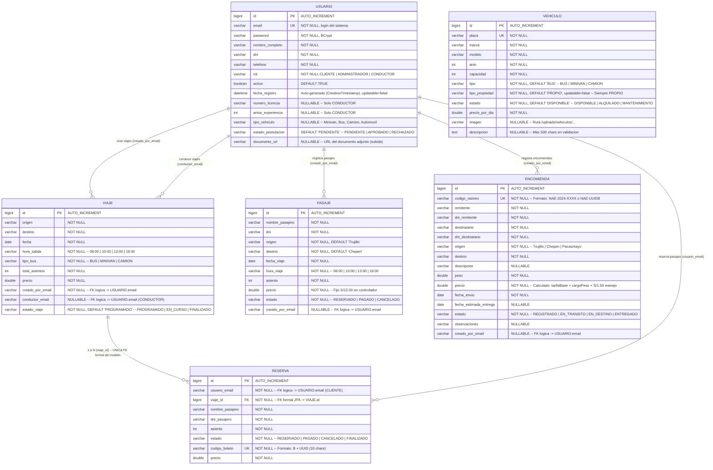

# Diagrama Lógico de Base de Datos — Nueva Ases

> **Motor de BD:** MySQL 8  
> **ORM:** JPA/Hibernate (Spring Boot 3)  
> **Base de datos:** `nuevaases_db`  
> **DDL auto:** `spring.jpa.hibernate.ddl-auto=update`  
> **Verificado contra:** Todos los modelos, DTOs, servicios, controladores, repositorios, configuraciones y manejadores de excepción del proyecto.

---

## 📊 Diagrama Entidad-Relación (Mermaid)



---

## 🗃️ Diccionario Completo de Tablas

### 1. `usuarios` — Usuarios del sistema (3 roles)

| # | Columna | Tipo SQL | Restricciones | DTO | Descripción |
|---|---|---|---|---|---|
| 1 | `id` | BIGINT | PK, AUTO_INCREMENT | ✅ Sí | Identificador único |
| 2 | `email` | VARCHAR(255) | **UNIQUE**, NOT NULL | ✅ | Correo electrónico (login del sistema) |
| 3 | `password` | VARCHAR(255) | NOT NULL | ❌ No en DTO | Contraseña cifrada con BCrypt |
| 4 | `nombre_completo` | VARCHAR(255) | NOT NULL | ✅ | Nombre completo |
| 5 | `dni` | VARCHAR(255) | NOT NULL | ✅ | Documento Nacional de Identidad |
| 6 | `telefono` | VARCHAR(255) | NOT NULL | ✅ | Teléfono de contacto |
| 7 | `rol` | VARCHAR(255) | NOT NULL | ✅ | **CLIENTE** \| **ADMINISTRADOR** \| **CONDUCTOR** |
| 8 | `activo` | BIT(1) | DEFAULT TRUE | ✅ | Soft-delete / bloqueo de cuenta |
| 9 | `fecha_registro` | DATETIME | `@CreationTimestamp`, updatable=false | ✅ | Auto-generado al crear |
| 10 | `numero_licencia` | VARCHAR(255) | NULLABLE | ✅ | Licencia de conducir (solo CONDUCTOR) |
| 11 | `anios_experiencia` | INT | NULLABLE | ✅ | Años de experiencia (solo CONDUCTOR) |
| 12 | `tipo_vehiculo` | VARCHAR(255) | NULLABLE | ✅ | Minivan, Bus, Camión, Automóvil |
| 13 | `estado_postulacion` | VARCHAR(255) | `@Builder.Default = "PENDIENTE"` | ✅ | **PENDIENTE** \| **APROBADO** \| **RECHAZADO** |
| 14 | `documento_url` | VARCHAR(255) | NULLABLE | ✅ | URL del documento adjunto |

**Reglas de negocio:**
- `email` y `dni` son únicos (validados en `RegistroController` y repositorio)
- Los conductores se registran con `activo=false` y `estado_postulacion="PENDIENTE"`
- Un administrador debe aprobar al conductor (`aprobarConductor()` → activo=true, APROBADO)
- `SecurityConfig` bloquea login de conductores no aprobados

---

### 2. `vehiculos` — Flota de vehículos

| # | Columna | Tipo SQL | Restricciones | DTO | Descripción |
|---|---|---|---|---|---|
| 1 | `id` | BIGINT | PK, AUTO_INCREMENT | ✅ | Identificador único |
| 2 | `placa` | VARCHAR(255) | **UNIQUE**, NOT NULL | ✅ | Placa del vehículo |
| 3 | `marca` | VARCHAR(255) | NOT NULL | ✅ | Marca (Mercedes-Benz, Toyota, etc.) |
| 4 | `modelo` | VARCHAR(255) | NOT NULL | ✅ | Modelo (Sprinter, Hiace, etc.) |
| 5 | `anio` | INT | NOT NULL, validación 2000-2030 | ✅ | Año de fabricación |
| 6 | `capacidad` | INT | NOT NULL, validación 1-50 | ✅ | Capacidad de pasajeros |
| 7 | `tipo` | VARCHAR(255) | NOT NULL, DEFAULT 'BUS' | ✅ | **BUS** \| **MINIVAN** \| **CAMION** |
| 8 | `tipo_propiedad` | VARCHAR(255) | NOT NULL, DEFAULT 'PROPIO', **updatable=false** | ❌ No en DTO | Siempre "PROPIO" (no editable) |
| 9 | `estado` | VARCHAR(255) | NOT NULL, DEFAULT 'DISPONIBLE' | ✅ | **DISPONIBLE** \| **ALQUILADO** \| **MANTENIMIENTO** |
| 10 | `precio_por_dia` | DOUBLE | NOT NULL, > 0 | ✅ | Tarifa de alquiler por día |
| 11 | `imagen` | VARCHAR(255) | NULLABLE | ✅ | Ruta `/uploads/vehiculos/<uuid>.<ext>` |
| 12 | `descripcion` | TEXT | NULLABLE, max 500 chars | ✅ | Descripción detallada |

**Nota:** `tipo_propiedad` se fuerza a "PROPIO" en `VehiculoServiceImpl.convertToEntity()` y no aparece en el DTO.

---

### 3. `viajes` — Viajes programados

| # | Columna | Tipo SQL | Restricciones | DTO | Descripción |
|---|---|---|---|---|---|
| 1 | `id` | BIGINT | PK, AUTO_INCREMENT | ✅ | Identificador único |
| 2 | `origen` | VARCHAR(255) | NOT NULL | ✅ | Ciudad de origen |
| 3 | `destino` | VARCHAR(255) | NOT NULL, != origen (validación) | ✅ | Ciudad de destino |
| 4 | `fecha` | DATE | NOT NULL | ✅ | Fecha del viaje |
| 5 | `hora_salida` | VARCHAR(255) | NOT NULL | ✅ | **08:00** \| **10:00** \| **13:00** \| **16:00** |
| 6 | `tipo_bus` | VARCHAR(255) | NOT NULL | ✅ | **BUS** \| **MINIVAN** \| **CAMION** |
| 7 | `total_asientos` | INT | NOT NULL | ✅ | Número total de asientos |
| 8 | `precio` | DOUBLE | NOT NULL | ✅ | Precio por asiento |
| 9 | `creado_por_email` | VARCHAR(255) | NOT NULL | ✅ | → Email del administrador que creó el viaje |
| 10 | `conductor_email` | VARCHAR(255) | NULLABLE | ❌ No en ViajeDTO | → Email del conductor asignado |
| 11 | `estado_viaje` | VARCHAR(255) | NOT NULL, DEFAULT 'PROGRAMADO' | ❌ No en ViajeDTO | **PROGRAMADO** \| **EN_CURSO** \| **FINALIZADO** |

**Nota importante:** Los campos `conductor_email` y `estado_viaje` existen en la entidad `Viaje` pero **no se incluyen en `ViajeDTO`**. Se usan directamente en el `DashboardController` para el panel del conductor.

**Datos de prueba (DataInitializer):**
- Ruta: Trujillo ↔ Chepén
- Precio: S/12.00, Asientos: 15, Tipo: MINIVAN
- Horarios: 08:00, 10:00, 13:00, 16:00
- Se generan 30 días × 4 horas × 2 direcciones = **240 viajes**
- Creados por: `admin@empresa.com`

---

### 4. `reservas` — Reservas de pasajes (boleto formal con FK)

| # | Columna | Tipo SQL | Restricciones | DTO | Descripción |
|---|---|---|---|---|---|
| 1 | `id` | BIGINT | PK, AUTO_INCREMENT | ✅ | Identificador único |
| 2 | `usuario_email` | VARCHAR(255) | NOT NULL | ✅ | → Email del cliente que reserva |
| 3 | `viaje_id` | BIGINT | **FK → viajes.id**, NOT NULL | ✅ (ViajeDTO anidado) | Viaje al que pertenece |
| 4 | `nombre_pasajero` | VARCHAR(255) | NOT NULL | ✅ | Nombre del pasajero |
| 5 | `dni_pasajero` | VARCHAR(255) | NOT NULL | ✅ | DNI del pasajero |
| 6 | `asiento` | INT | NOT NULL | ✅ | Número de asiento (1 a totalAsientos) |
| 7 | `estado` | VARCHAR(255) | NOT NULL | ✅ | **RESERVADO** \| **PAGADO** \| **CANCELADO** \| **FINALIZADO** |
| 8 | `codigo_boleto` | VARCHAR(255) | **UNIQUE**, NOT NULL | ✅ | Formato: `B` + UUID (10 chars) ej: `B5F3A2C1D8` |
| 9 | `precio` | DOUBLE | NOT NULL | ✅ | Precio pagado (hereda de Viaje.precio) |

**Relaciones:**
- **FK formal JPA (ManyToOne):** `Reserva.viaje_id → Viaje.id` (única FK del modelo)
- **Relación lógica:** `Reserva.usuario_email → Usuario.email` (sin constraint FK)

---

### 5. `pasajes` — Pasajes (registro simplificado, independiente)

| # | Columna | Tipo SQL | Restricciones | DTO | Descripción |
|---|---|---|---|---|---|
| 1 | `id` | BIGINT | PK, AUTO_INCREMENT | ✅ | Identificador único |
| 2 | `nombre_pasajero` | VARCHAR(255) | NOT NULL | ✅ | Nombre del pasajero |
| 3 | `dni` | VARCHAR(255) | NOT NULL | ✅ | DNI del pasajero |
| 4 | `origen` | VARCHAR(255) | NOT NULL, DEFAULT 'Trujillo' | ✅ | Ciudad de origen |
| 5 | `destino` | VARCHAR(255) | NOT NULL, DEFAULT 'Chepén' | ✅ | Ciudad de destino |
| 6 | `fecha_viaje` | DATE | NOT NULL | ✅ | Fecha del viaje |
| 7 | `hora_viaje` | VARCHAR(255) | NOT NULL | ✅ | **08:00** \| **10:00** \| **13:00** \| **16:00** |
| 8 | `asiento` | INT | NOT NULL | ✅ | Número de asiento |
| 9 | `precio` | DOUBLE | NOT NULL, fijo S/12.00 | ✅ | Precio del pasaje |
| 10 | `estado` | VARCHAR(255) | NOT NULL | ✅ | **RESERVADO** \| **PAGADO** \| **CANCELADO** |
| 11 | `creado_por_email` | VARCHAR(255) | NULLABLE | ✅ | → Email del usuario que registró |

**Nota:** `Pasaje` es una tabla independiente. **No tiene ninguna relación JPA con otras tablas.** Se usa como un registro simple de venta de boletos, mientras que `Reserva` es el sistema formal con relación a `Viaje`.

---

### 6. `encomiendas` — Envío de paquetes

| # | Columna | Tipo SQL | Restricciones | DTO | Descripción |
|---|---|---|---|---|---|
| 1 | `id` | BIGINT | PK, AUTO_INCREMENT | ✅ | Identificador único |
| 2 | `codigo_rastreo` | VARCHAR(255) | **UNIQUE**, NOT NULL | ✅ | Formato: `NAE-2024-XXXX` o `NAE-UUID8` |
| 3 | `remitente` | VARCHAR(255) | NOT NULL | ✅ | Nombre del remitente |
| 4 | `dni_remitente` | VARCHAR(255) | NOT NULL | ✅ | DNI del remitente |
| 5 | `destinatario` | VARCHAR(255) | NOT NULL | ✅ | Nombre del destinatario |
| 6 | `dni_destinatario` | VARCHAR(255) | NOT NULL | ✅ | DNI del destinatario |
| 7 | `origen` | VARCHAR(255) | NOT NULL | ✅ | Ciudad origen (Trujillo, Chepén, Pacasmayo) |
| 8 | `destino` | VARCHAR(255) | NOT NULL | ✅ | Ciudad destino |
| 9 | `descripcion` | VARCHAR(255) | NULLABLE | ✅ | Descripción del contenido |
| 10 | `peso` | DOUBLE | NOT NULL | ✅ | Peso en kg |
| 11 | `precio` | DOUBLE | NOT NULL | ✅ | **Cálculo:** tarifaBase + cargoPesoExtra + S/1.50 manejo |
| 12 | `fecha_envio` | DATE | NOT NULL | ✅ | Fecha de registro |
| 13 | `fecha_estimada_entrega` | DATE | NULLABLE | ✅ | Fecha estimada de entrega |
| 14 | `estado` | VARCHAR(255) | NOT NULL | ✅ | **REGISTRADO** \| **EN_TRANSITO** \| **EN_DESTINO** \| **ENTREGADO** |
| 15 | `observaciones` | VARCHAR(255) | NULLABLE | ✅ | Notas adicionales |
| 16 | `creado_por_email` | VARCHAR(255) | NULLABLE | ✅ | → Email del usuario que registró |

**Cálculo de precio (en `EncomiendaServiceImpl`):**
```java
tarifaBase(org, dst):
  Trujillo-Chepén o viceversa = S/5.00
  Trujillo-Pacasmayo o viceversa = S/4.50
  Chepén-Pacasmayo o viceversa = S/3.50
  default = S/5.00

cargoPesoExtra = (peso - 10kg) * S/1.50  (solo si peso > 10kg)
cargoManejo = S/1.50

Precio final = tarifaBase + cargoPesoExtra + cargoManejo
```

---

## 🔗 Resumen de Relaciones

| # | Tipo | Entidad FK | Entidad PK | Columna FK | Cardinalidad | Dirección |
|---|---|---|---|---|---|---|
| 1 | **Formal JPA** | `RESERVA` | `VIAJE` | `viaje_id` → `id` | Muchos a 1 | Unidireccional (solo Reserva → Viaje) |
| 2 | **Lógica** | `RESERVA` | `USUARIO` | `usuario_email` → `email` | Muchos a 1 | Aplicación |
| 3 | **Lógica** | `VIAJE` | `USUARIO` | `creado_por_email` → `email` | Muchos a 1 | Aplicación |
| 4 | **Lógica** | `VIAJE` | `USUARIO` | `conductor_email` → `email` | Muchos a 1 | Aplicación |
| 5 | **Lógica** | `PASAJE` | `USUARIO` | `creado_por_email` → `email` | Muchos a 1 | Aplicación |
| 6 | **Lógica** | `ENCOMIENDA` | `USUARIO` | `creado_por_email` → `email` | Muchos a 1 | Aplicación |

> **Importante:** Las relaciones lógicas (2-6) **no tienen restricción FK a nivel BD**. Se gestionan exclusivamente a nivel de aplicación Java. La única FK real es `reservas.viaje_id → viajes.id`.

---

## 🔑 Índices y Constraints

| Tipo | Tabla | Columna(s) | Propósito |
|---|---|---|---|
| **PK** | Todas | `id` | Primary key auto-incremental |
| **UK** | `usuarios` | `email` | Login único |
| **UK** | `usuarios` | `email` | Login único |
| **UK** | `vehiculos` | `placa` | Placa única |
| **UK** | `reservas` | `codigo_boleto` | Código de boleto único |
| **UK** | `encomiendas` | `codigo_rastreo` | Código de seguimiento único |
| **FK** | `reservas` | `viaje_id` → `viajes.id` | Única FK formal del modelo |
| **Default** | `vehiculos.tipo` | — | `'BUS'` |
| **Default** | `vehiculos.tipo_propiedad` | — | `'PROPIO'` |
| **Default** | `vehiculos.estado` | — | `'DISPONIBLE'` |
| **Default** | `viajes.estado_viaje` | — | `'PROGRAMADO'` |
| **Default** | `usuarios.estado_postulacion` | — | `'PENDIENTE'` |

---

## 🧠 Observaciones Finales del Análisis Exhaustivo

| Aspecto | Detalle |
|---|---|
| **Total entidades** | 6 (Usuario, Vehiculo, Viaje, Reserva, Pasaje, Encomienda) |
| **Total FKs formales** | **1** (Reserva → Viaje) |
| **Total FKs lógicas** | **5** (vía campo email) |
| **Total UKs** | **4** (email, placa, codigo_boleto, codigo_rastreo) |
| **Columnas totales** | 14 (Usuario) + 12 (Vehiculo) + 11 (Viaje) + 9 (Reserva) + 11 (Pasaje) + 16 (Encomienda) = **73 columnas** |
| **Entidades SIN DTO** | Ninguna (todas tienen DTO) |
| **DTO expone password** | ❌ No (seguridad) |
| **DTO expone tipo_propiedad** | ❌ No (oculto intencionalmente) |
| **DTO omite conductor_email** | ❌ No en ViajeDTO (solo en entidad Viaje) |
| **DTO omite estado_viaje** | ❌ No en ViajeDTO (solo en entidad Viaje) |
| **Entidades sin relación JPA** | Vehiculo, Pasaje (independientes) |
| **Datos no persistidos en BD** | Formulario de contacto, solicitudes de alquiler (solo en memoria/simulación) |
| **Cascade / orphanRemoval** | ❌ No configurado |
| **Auditoría temporal** | Solo `@CreationTimestamp` en `Usuario.fechaRegistro` |
| **Soft-delete** | Solo `Usuario.activo` (boolean) |
| **Validaciones servidor** | Presentes en `VehiculoController` (regex, rangos) y `RegistroController` |
| **Lombok** | `@Data`, `@Builder`, `@NoArgsConstructor`, `@AllArgsConstructor` en todas las entidades |

---

## 📐 Convenciones del Modelo

| Convención | Detalle |
|---|---|
| **Naming BD** | Snake case: `nombre_completo`, `fecha_envio`, `codigo_rastreo` |
| **Naming Java** | CamelCase: `nombreCompleto`, `fechaEnvio`, `codigoRastreo` |
| **Mapping** | `@Table(name = "usuarios")`, `@Column(name = "nombre_completo")` |
| **Estrategia ID** | `GenerationType.IDENTITY` (auto-increment MySQL) |
| **Fetch de relación** | `FetchType.LAZY` en Reserva.@ManyToOne |
| **Construcción** | Patrón Builder (`@Builder`) en todas las entidades |
| **Mapa de tipos** | `String` → `VARCHAR(255)`, `double` → `DOUBLE`, `int` → `INT`, `boolean` → `BIT(1)`, `LocalDate` → `DATE`, `LocalDateTime` → `DATETIME`, `TEXT` → `TEXT` |
